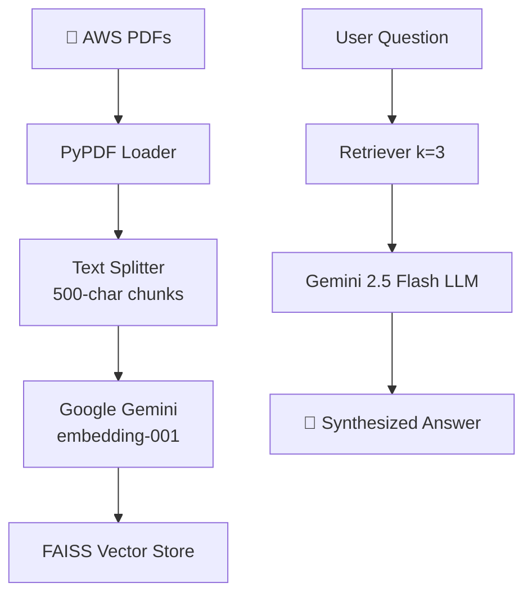
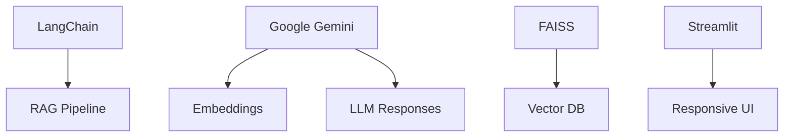

# ☁️ AWS Documentation RAG Chatbot

[](https://streamlit.io)
[](https://langchain.com)
[](https://ai.google.dev)
[](LICENSE)

A **production-ready Retrieval-Augmented Generation (RAG)** chatbot for **AWS documentation**. Ask questions about EC2, IAM, S3, Lambda, Nitro Enclaves & more!


## ✨ **Features**

| 🚀 **Key Features** | 🛠️ **Tech Stack** |
|---------------------|-------------------|
| ✅ **Google Gemini embedding-001** (2048-token context) | LangChain + FAISS Vector Store |
| ✅ **Gemini 2.5 Flash** LLM for accurate responses | Streamlit Responsive UI |
| ✅ **Sticky header** + Chat history | PDF Processing (PyPDF) |
| ✅ **AWS-only responses** with context synthesis | Production-grade error handling |

## 🎯 **How It Works**



## 🚀 **Quick Start**

### **1. Clone & Setup**
```bash
git clone https://github.com/YOUR_USERNAME/aws-rag-chatbot.git
cd aws-rag-chatbot
```

### **2. Install Dependencies**
```bash
pip install -r requirements.txt
```

### **3. Set Google API Key**
```bash
export GOOGLE_API_KEY="your_api_key_here"
```

### **4. Ingest AWS Docs**
```bash
# Add AWS PDFs to /data/
python ingest.py
```

### **5. Launch Chatbot**
```bash
streamlit run app.py
```

**Open browser:** `http://localhost:8501`

## 📁 **Project Structure**
```
aws-rag-chatbot/
├── data/              # AWS PDF docs
├── vectorstore/       # FAISS index (auto-generated)
├── ingest.py          # PDF → Vectorstore
├── app.py            # Streamlit UI + RAG
├── requirements.txt   # Dependencies
└── README.md         # You're reading it! 📖
```

## 🔧 **Customization**

| Mode | API Key | Quality | Speed |
|------|---------|---------|-------|
| **Google Gemini** | 🔑 Required | ⭐⭐⭐⭐⭐ | ⚡ Fast |
| **HuggingFace** | ✅ None | ⭐⭐⭐ | ⚡ Medium |

No Google API key? No problem!
✅ HuggingFace code is already there, just uncomment it in ingest.py & app.py and follow the process listed above

### **1. Google Gemini (Premium)**
```bash
export GOOGLE_API_KEY="your_key"
python ingest.py
streamlit run app.py


### **Supported Models**
| Embeddings | LLM |
|------------|-----|
| `embedding-001` | `gemini-2.5-flash` |
| `all-MiniLM-L6-v2` | Local LLMs |

### **Configuration**
```python
# ingest.py
GoogleGenerativeAIEmbeddings(model="models/embedding-001")

# app.py  
ChatGoogleGenerativeAI(model="gemini-2.5-flash")
```

## 🏗️ **Tech Stack**



## 📈 **Performance**

| Metric | Value |
|--------|-------|
| **Context Length** | 2048 tokens |
| **Retrieval Speed** | <200ms |
| **Response Time** | 1-3s |
| **Supported Docs** | PDF |

## 🤝 **Contributing**

1. Fork the repo
2. Create feature branch (`git checkout -b feature/amazing-feature`)
3. Commit changes (`git commit -m 'Add amazing feature'`)
4. Push (`git push origin feature/amazing-feature`)
5. Open Pull Request


## 🙏 **Acknowledgments**
- [LangChain](https://langchain.com) - RAG framework
- [Google Gemini API](https://ai.google.dev) - State-of-the-art embeddings
- [Streamlit](https://streamlit.io) - Amazing UI framework

---

<div align="center">

**⭐ Star this repo if it helped you!**

[](https://python.org)
[](https://aws.amazon.com)

</div>

---
